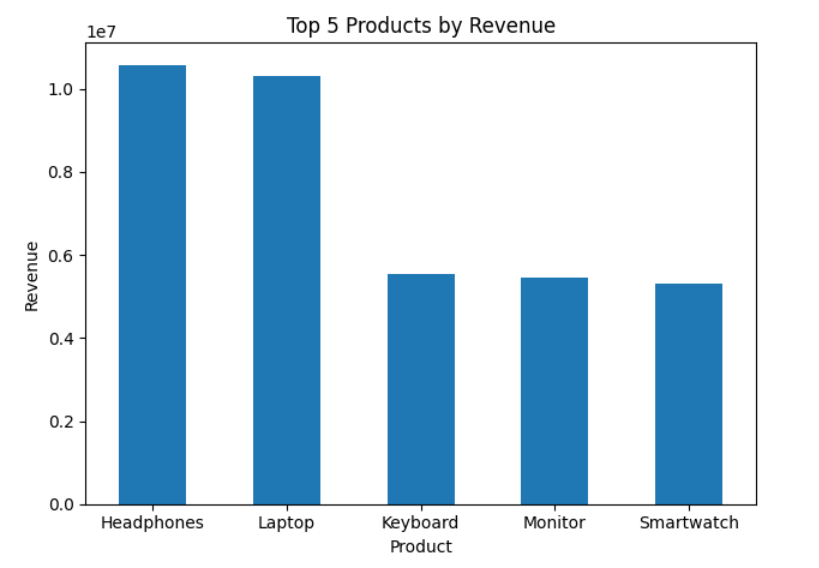
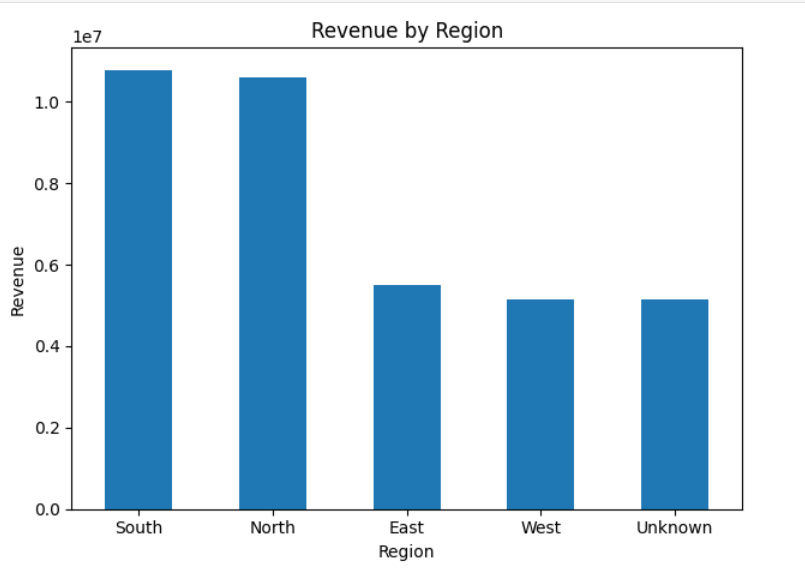
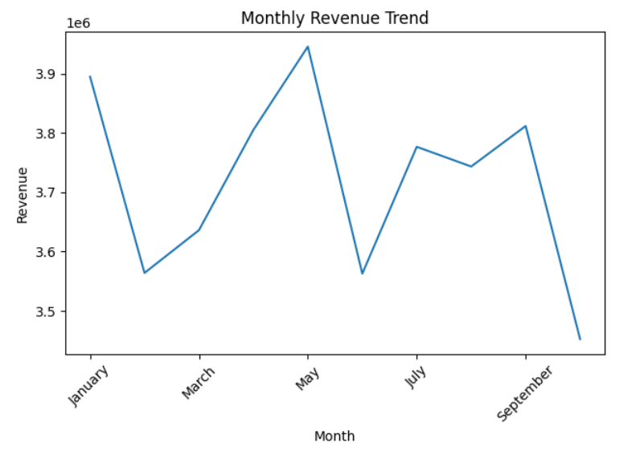
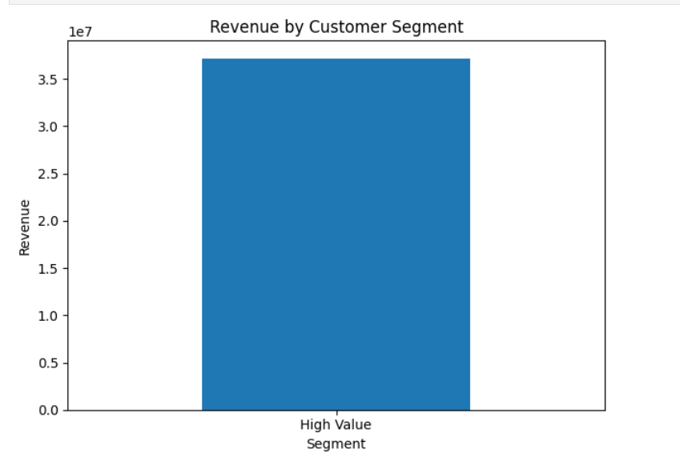
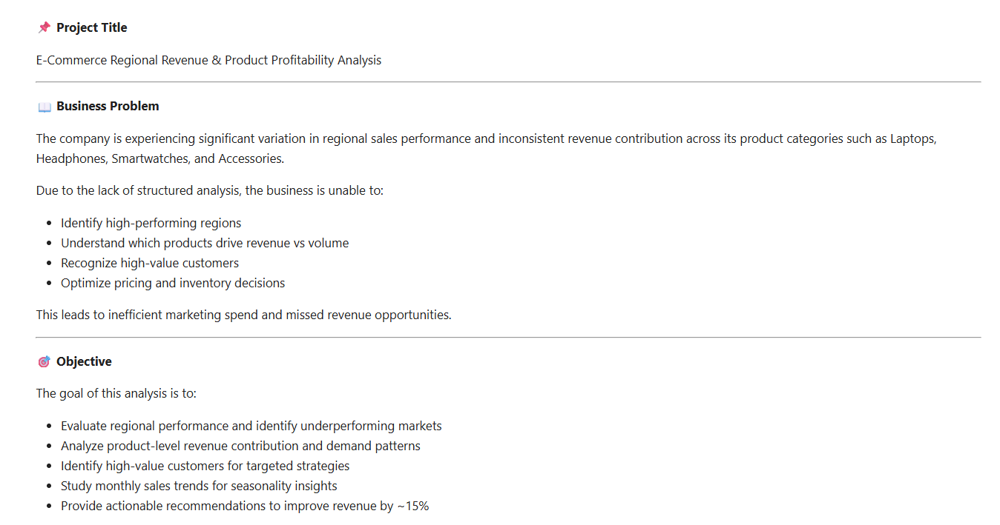
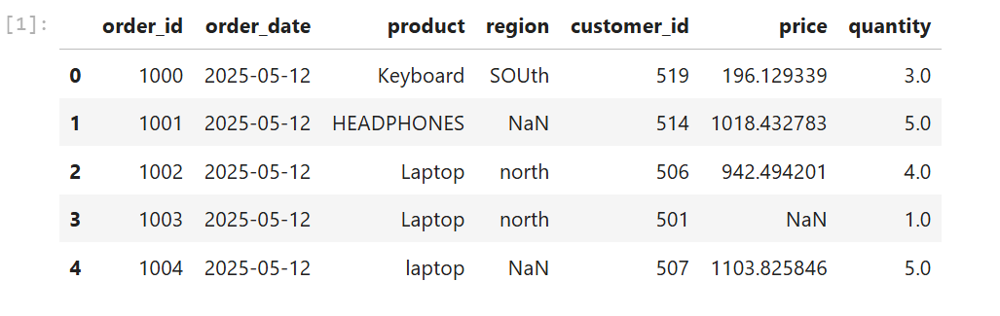
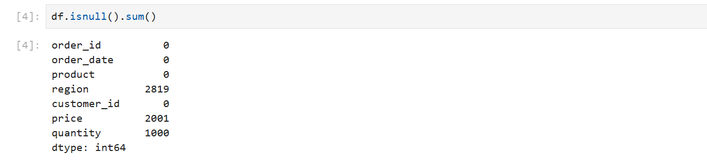
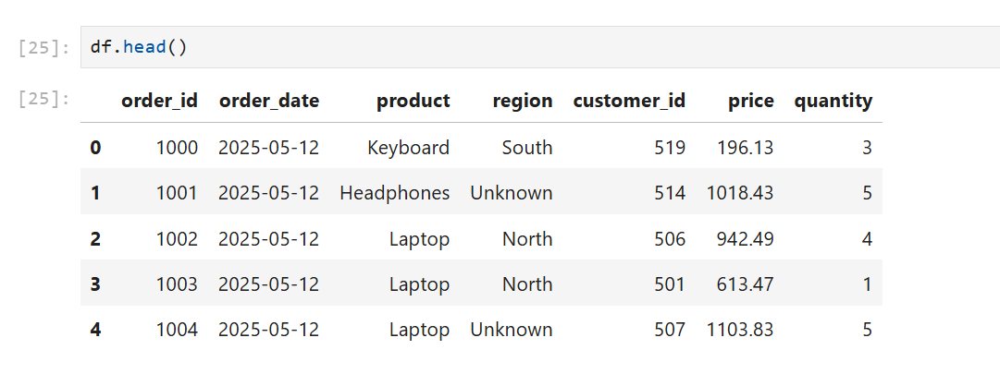
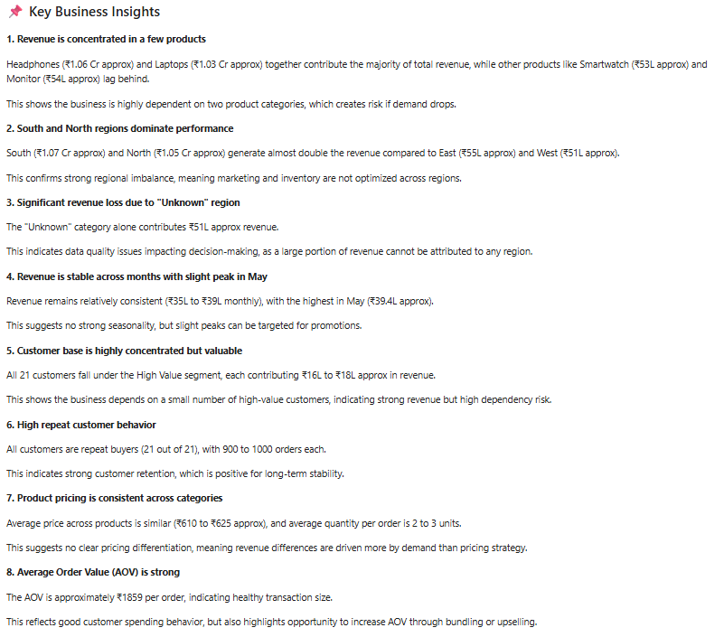

# 📊 E-Commerce Revenue & Product Profitability Analysis

## 📌 Project Overview

This project analyzes an e-commerce sales dataset to identify key revenue drivers, customer behavior, and regional performance.

The goal is to transform raw, messy data into meaningful business insights that can support decision-making and improve revenue performance.

---

## 🎯 Business Problem

The company faces:

* Uneven regional sales performance
* Heavy dependency on a few product categories
* Lack of visibility into customer value
* Inefficient decision-making due to unstructured data

---

## 🧠 Objective

* Identify top-performing products and regions
* Analyze customer spending behavior
* Evaluate monthly sales trends
* Provide actionable recommendations to improve revenue

---

## ⚙️ Tech Stack

* Python
* Pandas
* Matplotlib
* Jupyter Notebook

---

## 🧹 Data Cleaning & Preparation

The dataset contained several real-world issues:

* Missing values in price, quantity, and region
* Inconsistent categorical values (e.g., Laptop vs laptop)
* Duplicate records
* Extreme outliers (price = 1,000,000)
* Incorrect data types

### ✔️ Cleaning Steps Performed

* Removed duplicate records
* Standardized categorical columns
* Handled missing values using median imputation
* Removed outliers
* Converted data types (date, quantity)
* Rounded price values

---

## ⚙️ Feature Engineering

* Created **Revenue = Price × Quantity**
* Extracted **Month and Quarter**
* Built **Customer Segmentation (High Value)**

---

## 📊 Key Visualizations

### 🔹 Top Products by Revenue



---

### 🔹 Revenue by Region



---

### 🔹 Monthly Revenue Trend



---

### 🔹 Revenue by Customer Segment



---

## 📊 Key Insights

* Headphones (~₹1.06 Cr) and Laptops (~₹1.03 Cr) dominate revenue
* South and North regions contribute ~₹1 Cr each, while East/West lag (~₹50L)
* ~₹51L revenue is mapped to "Unknown" region → data quality issue
* Revenue remains stable (~₹35L–₹39L monthly) with slight peak in May
* All customers are high-value (₹16L–₹18L each) with strong repeat behavior
* Average Order Value (AOV) ≈ ₹1859

---

## 📌 Business Recommendations

* Improve performance in East & West through targeted campaigns
* Reduce dependency on top products by promoting other categories
* Fix missing region data for better decision-making
* Introduce loyalty programs for high-value customers
* Use bundling strategies to increase AOV

---

## 📁 Project Structure

```
├── data/
│   └── messy_sales_data.csv
│
├── notebooks/
│   └── analysis.ipynb
│
├── outputs/
│   ├── cleaned_data.csv
│   └── charts/
│
├── screenshots/
│
└── README.md
```

---

## 📸 Project Screenshots

### 🔹 Problem Statement



### 🔹 Raw Data



### 🔹 Missing Values



### 🔹 Cleaned Data



### 🔹 Insights



---

## 🚀 Key Learnings

* Handling messy real-world datasets
* Converting raw data into business insights
* Applying structured data analysis workflow
* Thinking from a business perspective, not just coding

---

## 👨‍💻 Author

Ayush

---
